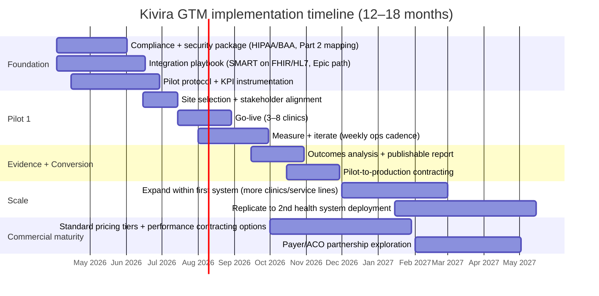

# Deep Research Report on Kivira.health as an AI Diagnostic Platform for Mental Health in Primary Care

## Executive summary

Kivira.health positions itself as a clinician-first, AI-powered diagnostic and decision-support platform built specifically for **mental health in primary care**. Public materials indicate a **B2B model** sold to clinics/health systems, with a patient mobile app used for intake/screening and **EHR workflow integration** via interoperability standards such as **SMART on FHIR and HL7**, including an explicit pathway for **Epic/MyChart-based invitations**. The platform is framed as **clinical decision support (CDS)** (not autonomous diagnosis), with documented safety behaviors such as automated clinician notification when responses suggest self-harm risk (subject to clinic configuration), plus crisis-resource communications that are explicitly not real-time monitoring. citeturn4search3turn27view0turn28view0

From an execution standpoint, Kivira appears to have credible early ecosystem traction: it won the University of Chicago’s Global New Venture Challenge (GNVC) in 2025, and University of Chicago/Polsky Center reporting (March 2026) states Kivira closed a **$1.8M pre-seed** led by Wellstar Health System and had interviewed **300+ primary care providers** during discovery. citeturn7search11turn5view0 Public signals also suggest earlier pre-seed involvement from Antler (e.g., Antler portfolio mention; third-party databases report an Antler pre-seed entry), though precise round structure and totals vary by source and should be treated as partially verified. citeturn7search6turn7search5

Strategically, Kivira’s chosen wedge (primary care) maps to a real and growing pain: **primary care is already delivering a large share of mental health care**, including the majority of antidepressant/anxiolytic prescribing in employer-sponsored insurance populations. citeturn9search4 At the same time, adoption of EMR-integrated clinical decision support is repeatedly shown to be constrained by workflow, usability, organizational approval, and implementation resources—raising the bar on integration quality, evidence, and change management. citeturn15search4 The biggest gap in public evidence today is **Kivira-specific clinical validation** (peer-reviewed outcomes, external benchmark accuracy, bias auditing, and real-world utility claims). No peer-reviewed Kivira validation study was found in the public sources reviewed; therefore, Kivira’s quantitative performance claims should be treated as **unverified marketing claims** until backed by transparent methods and results.

## Company overview

### What Kivira appears to be building

Kivira describes its core value proposition as improving diagnostic accuracy and treatment decisions for mental health conditions in primary care by combining (1) evidence-based screening, (2) “digital phenotyping,” and (3) AI/ML analytics aligned to DSM-5 criteria, delivered within clinicians’ existing EHR workflow. citeturn4search3turn5view0

Publicly accessible documentation supports several concrete functional elements:

Kivira’s patient app (and related services) is presented as supporting intake, screening, and questionnaires, with optional integration to EHR systems and delivery of clinician-reviewed outputs (summaries/workflow artifacts), and it explicitly characterizes its outputs as **clinical decision support only** (not replacing clinician judgment). citeturn27view0

Kivira states it uses validated questionnaires/instruments and provides a public references page listing primary citations for common behavioral health scales (e.g., PHQ-9, GAD-7, Yale-Brown Obsessive Compulsive Scale, Columbia Suicide Severity Rating Scale). The page also explicitly states that the tools support care and do not provide a diagnosis by themselves. citeturn28view0

The platform’s safety design, as documented in patient terms, includes automated notification to the patient’s healthcare provider when responses indicate risk of self-harm (depending on clinic configuration), plus optional crisis-resource emails. The app also is explicit that it provides **no continuous/real-time monitoring** and is not for emergencies. citeturn27view0

### Integration into clinical workflows

Kivira’s marketing emphasizes “screen and prescribe without extra steps” and “fit directly into your existing EHR workflow.” citeturn4search3 The most operationally specific details are in the patient app terms:

Interoperability methods: the app references **SMART on FHIR** and **HL7** (or similar methods) for integration. citeturn27view0

Epic/MyChart pathway: patient onboarding can occur via an “Epic MyChart invitation route,” with the patient authenticating through Epic SMART on FHIR OAuth flows; Kivira states it does not receive the patient’s MyChart password. citeturn27view0

Implication: Kivira is aiming for a “native-feeling” workflow—patients complete structured assessments and clinicians receive summarized outputs inside existing systems—matching what the literature identifies as essential for adoption of CDS tools in practice. citeturn15search4

What remains unspecified publicly: which EHRs are supported beyond the explicit Epic example; whether Kivira supports write-back into notes/problem list/orders; the extent of registry support (important for Collaborative Care); and whether integrations are generally available or bespoke per customer.

### Pricing model

No public price sheet or typical contract range was found on Kivira’s website.

One clear economic detail exists: Kivira’s **patient app is free to patients**, and the **clinic/customer pays Kivira**. citeturn27view0

Inference (clearly labeled): given the buyer is the clinic/health system and Kivira is integrating into EHR workflows, the most likely pricing structures are subscription (per site/per clinician/per clinic) and/or annual platform fees with implementation/integration services, potentially with outcomes-based components to align with purchaser expectations. This is consistent with broader digital health purchasing patterns: many purchasers contract for relatively short periods (often ≤2 years) and tie performance metrics to outcomes and satisfaction. citeturn20view2turn20view3turn20view4

### Funding history and corporate traction signals

Public sources show multiple traction markers but inconsistent round accounting across third-party databases:

University of Chicago/Polsky reporting says Kivira closed a **$1.8M pre-seed** led by entity["organization","Wellstar Health System","health system georgia, US"], and frames this as capital plus deployment partnership (“deploy… into real clinical workflows” is also echoed by the founder in a LinkedIn post). citeturn5view0turn6search0

Kivira won first place at the 18th GNVC and received **$50,000** (prize pool allocation noted by Polsky). citeturn7search11

entity["company","Antler","early-stage vc accelerator"] publicly lists Kivira in its portfolio and highlighted Kivira in a 2025 portfolio showcase post. citeturn7search16turn7search6 A third-party private markets database (Preqin) reports a **$200,000** pre-seed raise from Antler dated May 6, 2025. citeturn7search5 Because these can reflect partial rounds, syndicated SAFE notes, or differing definitions of “funding,” they should not be treated as a reconciled cap table.

Kivira is shown as an active corporate member on the entity["organization","Stanford Center for Precision Mental Health and Wellness","stanford psychiatry center"] corporate members program page (logo included among active corporate members), indicating at minimum a formal industry-affiliate relationship with a defined fee structure for early-stage companies. citeturn25view0

### Pilots and partnerships

Wellstar: The pre-seed lead investor relationship is publicly stated by Polsky, and the founder’s public post asserts deployment into Wellstar workflows. citeturn5view0turn6search0 Wellstar also has public-facing messaging about embedding behavioral health practitioners in primary care settings, suggesting organizational alignment with integrated behavioral health workflows (a favorable context for Kivira’s wedge). citeturn4search11

UChicago Medicine: No public source confirming a formal pilot deployment at entity["organization","UChicago Medicine","academic health system chicago, IL, US"] was found. However, Polsky reporting states Kivira’s founder engaged “UChicago Medicine physicians, faculty advisors, and legal experts” during discovery. citeturn5view0 If a UChicago Medicine pilot exists, it is not publicly documented in the sources reviewed and should be treated as **unspecified**.

Stanford PMH corporate membership: documented on Stanford’s program page (logo listed among active corporate members). Program requirements and fee tiers are public, including an “emerging start-ups” rate for the affiliate tier. citeturn25view0

### Target customer segments

Kivira’s primary go-to-market entry is explicitly primary care. citeturn4search3turn5view0

Kivira’s long-term expansion targets were stated in Polsky reporting as extending diagnostic infrastructure across hospitals, private practices, universities, employee assistance programs, veteran services, and government systems. citeturn5view0

## Market analysis

### Why “mental health in primary care” is a credible wedge

Primary care already carries a large portion of mental health workload. A Health Care Cost Institute (HCCI) analysis reports that primary care providers prescribe approximately **74%** of antidepressant and anxiolytic prescription fills among people with employer-sponsored insurance. citeturn9search4 An American Academy of Family Physicians (AAFP) policy statement similarly notes that roughly **40% of office visits for mental health concerns** occur in primary care settings. citeturn21search17

Meanwhile, research suggests the proportion of primary care visits addressing mental health concerns has increased over time: one Health Affairs study found growth from **10.7% (2006–07) to 15.9% (2016–18)**. citeturn21search24 These trends give diagnostic support tools a clear “where the work happens” entry point.

### Market size and growth

Because “mental-health-in-primary-care” is not a standard market category with a single authoritative TAM figure, sizing requires triangulation. The most defensible approach is to anchor on adjacent measurable markets and utilization data:

Behavioral health software & services (U.S.): Grand View Research estimates the U.S. behavioral health care software and services market at **$1.49B (2024)** with projected **~12.47% CAGR (2025–2030)**. citeturn21search9 This is a reasonable proxy for the “platform budget envelope” into which diagnostic CDS, screening, workflow, and measurement tools compete.

Behavioral health service utilization growth: An American Hospital Association market scan citing Trilliant Health reports behavioral health visit volume of **66.4M (2024)** compared with **62.8M primary care visits** among commercially insured patients, with behavioral health utilization **up 44% since 2018** and primary care visits down 7% over that period. citeturn21search4

Digital health purchasing priorities: The Peterson Health Technology Institute (PHTI) surveyed 332 digital health purchasers and found that purchasers commonly buy digital solutions for **primary care (62%)** and **mental health (56%)**; and they prioritize these areas going forward as well (primary care 46%, mental health 50%). citeturn20view5turn18view0

### Integrated behavioral health maturity and whitespace

A Robert Graham Center/HealthLandscape report (AAFP ecosystem) provides a concrete snapshot of integrated care spread:

It reports **118,500 primary care physicians co-located with nearly 140,000 behavioral health clinicians in ~23,000 primary care practices**, representing **~38% of primary care practices**. It also states primary care physicians provide **45% of visits** to patients with depression and/or anxiety (about half co-managed with non-physician behavioral health clinicians). citeturn12view2

The same report highlights equity/coverage gaps: only **~6–10%** of integrated, co-located primary care practices are located in the highest-need communities (example metro breakdown includes Atlanta). citeturn12view1

For Kivira, these data imply two opportunities:

A near-term “install base” of integrated practices where mental health workflows exist but can be made more efficient/precise.

A longer-term wedge into non-integrated practices where structured assessment and decision support could reduce missed identification and improve referral targeting—provided the product does not add workflow burden.

### Primary care purchasing decision-makers and buying dynamics

Buying patterns vary by setting:

Health systems and large groups: decisions are typically multi-stakeholder, involving clinical champions, IT/informatics (EHR integration), security/compliance, finance, and contracting. This aligns with the broader digital health purchasing landscape where surveyed decision-makers “make or significantly influence” purchasing decisions across health plans, employers, and health systems. citeturn18view0

Contract structure expectations: PHTI reports that purchasers often evaluate digital health solutions on short cycles—**59%** report contract durations of **≤2 years**—and commonly measure contract performance with **clinical outcomes** (health systems 88%, health plans 95%) and utilization/financial impact. citeturn20view2turn20view3

Value analysis committees and cross-functional procurement: medtech and health systems commonly use value analysis processes to control costs and standardize purchasing. citeturn15search9

Independent primary care / small groups: decisions often concentrate with physician owners/medical directors and practice administrators, but still hinge on EHR friction and ongoing costs. AHRQ’s digital health materials note small practices face meaningful EHR costs (up-front and ongoing), which makes incremental point solutions compete for scarce operational bandwidth and budget. citeturn15search16

### Reimbursement and billing codes relevant to digital diagnostics and structured screening

For a diagnostic-support product in primary care, reimbursement strategy is not just “nice to have”—it’s the oxygen supply.

Depression screening coverage (Medicare): CMS supports depression screening in adults as a preventive service, consistent with USPSTF recommendations. citeturn14search29 Medicare has long recognized HCPCS **G0444** for annual depression screening (time-limited) and updated billing guidance for telehealth POS codes effective 2025. citeturn14search0

Brief behavioral/emotional assessment: The AAFP has published billing guidance that references **CPT 96127** for instruments like PHQ-9 and notes Medicare’s preventive depression screening coverage through **G0444** in primary care settings with appropriate supports. citeturn14search2

Collaborative Care Model (CoCM) codes: CMS provides a “Behavioral Health Integration Services” MLN booklet describing billing for psychiatric CoCM using CPT **99492**, **99493**, and add-on **99494**, and HCPCS **G2214** (initial/subsequent psychiatric CoCM 30 minutes). The MLN booklet also outlines required elements like registry use and psychiatric consultant caseload consultation. citeturn11view0turn10view0

Practical implication for Kivira: If Kivira can measurably increase documentation quality, standardized assessments, and care management workflows, it can be priced against incremental revenue capture and/or cost avoidance—especially for organizations scaling integrated care.

### Regulatory and compliance considerations

FDA: The FDA’s clinical decision support software guidance clarifies which CDS functions may be excluded from the definition of a device under statutory “Non-Device CDS” criteria and reiterates that device software functions remain subject to FDA oversight. citeturn13search0 Separately, FDA guidance on Predetermined Change Control Plans (PCCPs) addresses how AI-enabled devices can be updated while maintaining safety and effectiveness—highly relevant if a company is making device-level claims and iterating models over time. citeturn13search1turn13search5

HIPAA: HHS defines a “business associate” as an entity performing certain functions involving PHI on behalf of, or providing services to, a covered entity. citeturn13search2 Kivira’s patient app terms explicitly state that where Kivira integrates with EHR systems, it acts as a HIPAA Business Associate under BAAs with healthcare providers. citeturn27view0

42 CFR Part 2: SAMHSA explains that Part 2 protects confidentiality of patient records for people receiving substance use disorder services in federally assisted programs, restricting when/how these records may be disclosed. citeturn13search3 If Kivira’s workflows touch SUD-related data in covered contexts, Part 2 constraints become material to product design and contracting.

### Adoption barriers

Peer-reviewed qualitative research on EMR-integrated CDS adoption highlights repeated barriers: clinician resistance, organizational approval, usability/workflow integration challenges, limited infrastructure/resources, alert fatigue, and negative prior experiences with EHR disruptions contributing to burnout. citeturn15search4

The integrated care report emphasizes structural obstacles like workforce shortages, stigma, and cost, and describes payment reform and shared medical records as crucial to integrated care success. citeturn12view2turn12view1

Bottom line: Kivira’s product has to be not only “more accurate,” but operationally lighter than status quo.

## Competitive landscape

### Competitor set definition

Given Kivira’s positioning (AI-driven diagnostic clarity + workflow integration in primary care), the fairest comparison includes:

EHR-integrated behavioral health measurement and integrated-care enablement platforms.

AI-driven intake/triage assessment tools deployed at scale.

Voice / digital biomarker approaches for depression/anxiety detection (adjacent but often marketed as early warning, screening, or care management).

### Competitor comparison table

| Company | Primary wedge / buyer | Core data modality | Workflow & integration posture | Evidence / validation signals | Regulatory posture | Pricing (public) | GTM notes |
|---|---|---|---|---|---|---|---|
| Kivira (subject) | Primary care clinics / health systems | Patient questionnaires + “digital phenotyping” + ML (details of phenotyping signals are not public) | Explicit SMART on FHIR/HL7; explicit Epic/MyChart invite route; outputs positioned as CDS; safety alert notifications (configurable) | No peer-reviewed Kivira validation found; uses validated instruments with public references | Marketed/contracted as CDS; FDA pathway not stated publicly | Not listed; patient app free; clinic pays | Early health system partnership & investment; aims to minimize workflow change |
| **entity["company","NeuroFlow","behavioral health platform"]** | Health systems, payers, gov (integrated care / MBC) | Validated rating scales + patient-entered data + analytics | Emphasizes screening + decision support; evidence of multi-clinic deployment; EHR integration claims incl. VA systems | Peer-reviewed study describes deployment in 30 clinics (mostly primary care) at a large health system | Not framed as diagnostic device; behavioral health platform | Not listed | Strong “integrated care at scale” narrative; buyer includes population health leaders citeturn26search0turn26search19turn26search27 |
| **entity["company","Limbic","mental health clinical ai"]** | Health systems / NHS mental health pathways | Conversational AI for intake/assessment/triage | Maps to EHR/workflows; positioned as front door + triage; large-scale NHS use claims | Cites large patient volumes and published research; reports widespread NHS Talking Therapies use | Claims Class IIa medical device status in UK context | Not listed | Proven “intake efficiency + access expansion” wedge; less primary-care-US-specific but instructive citeturn26search1turn26search5turn26search13turn26search25 |
| **entity["company","Sonde Health","voice biomarker platform"]** | Employers, partners, digital channels | Short voice samples (vocal biomarkers) | Integrates into apps/devices; positioned as detection/tracking | Clinical research presence; published studies using Sonde app concepts exist | Often framed as early warning / monitoring (not always “diagnosis”) | Not listed | Strong partner strategy (telecom/employer channels), less EHR-native than Kivira citeturn26search2turn26search6turn26search10turn26search14 |
| **entity["company","Ellipsis Health","voice ai care management"]** | Health plans, care management orgs | Voice + semantics/acoustics | Integrates into care management calls/workflows; less “PCP-in-EHR” oriented | Company claims real-world call-study performance; additional academic feasibility exists | Navigates clinical validation; FDA status not clearly stated publicly | Not listed | GTM is “AI care manager + capacity,” adjacent to diagnosis but overlaps screening/triage citeturn26search3turn26search33turn26search26turn26search35 |
| **entity["company","Kintsugi","voice biomarker startup"]** | (Historical) mental health detection via speech | Speech analysis | Not applicable (company shutdown) | Reported performance comparable to PHQ-9 in some contexts; regulatory struggles | Reported difficulty obtaining FDA clearance; shut down | N/A | Illustrates FDA pathway risk for “depression-detecting AI” claims citeturn26news38 |

Interpretation: Kivira’s differentiator is primarily **EHR-native primary care workflow + structured assessment + diagnostic report framing**. NeuroFlow is the most adjacent in U.S. integrated-care workflow enablement; Limbic is a strong analog for regulated intake/triage at scale; voice-biomarker players compete on “objective signals,” but often land first in payer/employer channels rather than PCP EHR. citeturn27view0turn26search27turn26search5turn26news38

## Clinical evidence

### What the broader literature says about AI diagnostic tools in mental health

The peer-reviewed evidence base supports the idea that “AI can help,” but it also repeatedly warns that clinical translation is difficult.

Systematic reviews of AI in mental health (diagnosis, monitoring, intervention) conclude that AI approaches show promise across modalities (speech, text, wearables, smartphone sensors), but face challenges around bias, privacy, transparency, and generalizability. citeturn22search2turn22search36

Digital phenotyping (smartphone sensors/wearables): Recent reviews suggest that smartphone sensors can identify behavioral patterns associated with stress/anxiety/mild depression, and that digital phenotyping for major depressive disorder is an active area of feature-method development. citeturn22search0turn22search1 However, standardization and methodological consistency remain a major constraint, and there are technical and user-experience challenges that limit effectiveness. citeturn22search27turn22search4

Voice biomarkers: Research continues to explore whether voice recordings can detect or estimate depression/anxiety symptom severity. Studies and feasibility reports exist; for example, an Annals of Family Medicine paper evaluates an AI-based voice biomarker tool for detecting a depressive episode. citeturn22search15 Broader clinical and validation discussions emphasize the need for diverse datasets, careful validation design, and regulatory alignment. citeturn22search10turn22search7

Primary care diagnostic prediction models: Reviews focusing on AI-based diagnostic prediction models using EHR data for primary care decision-making indicate rapid growth but a need for synthesis on performance and applicability. citeturn22search25

### Clinical utility in primary care: likely benefits, realistic limits

Potential utility (supported by evidence and implementation literature):

Standardized structured assessments can improve detection and enable measurement-based care—especially in settings where time and psychiatric specialization are limited. citeturn15search4turn26search27

EHR-integrated tools that reduce friction and clearly communicate evidence are more likely to be adopted than tools that add workflow burden. citeturn15search4

Key risks (especially for “diagnostic” framing):

False positives: over-identification can lead to unnecessary treatment, patient distress, and downstream specialty burden.

False negatives: missed identification, especially for high-risk presentations like suicidality, is a safety risk.

Bias and performance disparity: models trained on limited or skewed data can underperform across demographic subgroups or clinical contexts—this is a recurrent concern across AI-in-mental-health reviews. citeturn22search2turn22search36

Privacy and agency: digital phenotyping and passive signals raise heightened consent, transparency, and governance needs. citeturn22search27turn22search31

### Kivira-specific clinical validation status

No peer-reviewed Kivira clinical validation paper or registered trial specific to Kivira was found in the public sources reviewed.

What is publicly verifiable is more “inputs and posture” than “outcomes”:

Kivira publicly lists validated instruments and references, and states they are used to support care rather than provide diagnosis on their own. citeturn28view0turn27view0

Kivira’s website makes quantitative claims (e.g., “increase in diagnosis accuracy,” “time-discounted accuracy” comparisons to tools like PHQ-9/GAD-7/MINI/Y-BOCS). These should be treated as **company claims** until accompanied by transparent study design, cohort details, comparator methodology, and external validation. citeturn4search3turn23search1

## Go-to-market recommendations

### GTM strategy principles that match buyer behavior

Digital health buyers increasingly expect evidence, ROI, and performance accountability:

PHTI’s survey shows purchasers increased spending largely due to consumer demand and outcomes; they prefer vendors with a proven track record and ROI, and often use risk-based contracts for at least some solutions. citeturn20view1turn20view4

Contract timelines are short enough that pilots must show value quickly: most contracts are ≤2 years, creating a narrow “prove it” window. citeturn20view2

Therefore, Kivira’s GTM must be designed around **fast time-to-value**, **observable clinical workflow improvements**, and **credible evidence generation**.

### Recommended sales motions

Primary motion: health-system primary care + integrated behavioral health leadership  
Lead with health systems (and large multi-site primary care groups) that already run or are expanding integrated behavioral health / CoCM programs. These organizations have the strongest economic incentive to improve triage accuracy, reduce ineffective trial-and-error treatment, and document care appropriately under existing billing structures. citeturn11view0turn12view2

Deal team mapping (typical):  

Clinical champion (family medicine leader / integrated care director)

Informatics/IT (EHR integration owner; CMIO/clinical informatics)

Behavioral health integration / CoCM operations

Compliance/privacy (HIPAA/Part 2 exposure)

Finance/revenue cycle (coding, documentation, contract value)

Procurement/value analysis (standard in health system purchasing) citeturn15search9turn20view3

Secondary motion: payer/ACO partners focused on antidepressant spend and avoidable escalation  
Given the scale of mental health prescribing in primary care, payer-aligned programs can justify diagnosis-support tools via avoided utilization and improved pathway targeting. citeturn9search4turn20view3

### Pilot design

A strong pilot needs to answer one question: “Does this measurably improve outcomes and throughput without breaking workflow?”

Pilot scope (recommended):

Sites: 3–8 primary care clinics (mix of high-need and typical populations)

Duration: 90–120 days active measurement, with 30 days baseline

Target population: patients screening positive for depression/anxiety symptoms and/or presenting with mental health concerns in PCP visits

Workflow: EHR-triggered structured assessment; clinician receives report inside workflow; escalation rules and safety alerts configured with the clinic citeturn5view0turn27view0

### Pilot KPIs table

| KPI category | KPI | Definition | Target signal (directional) | Data source |
|---|---|---|---|---|
| Clinical quality | Diagnostic concordance (proxy) | % agreement between Kivira-supported PCP assessment vs psychiatric consult / structured interview sample | Increase vs baseline | Chart review + specialist adjudication sample |
| Clinical quality | Treatment-pathway appropriateness | % of patients with guideline-consistent first-step plan (med/start, therapy referral, CoCM enrollment, watchful waiting) | Increase | Chart review + EHR orders/referrals |
| Safety | High-risk capture & response time | % of high-risk screens (e.g., suicidal ideation instruments) with documented follow-up within defined SLA | Increase + faster | Kivira alert logs + EHR tasking/work queues citeturn27view0turn28view0 |
| Workflow | Time-to-assessment completion | Median time from trigger to completed assessment | Decrease | App telemetry + EHR timestamps |
| Workflow | Clinician time saved | Minutes saved per mental-health-relevant visit (self-reported + observational) | Decrease | Time-motion + clinician survey |
| Adoption | Eligible-patient completion rate | % of eligible patients completing assessments | ≥60–75% (context-dependent) | App telemetry |
| Financial | Incremental reimbursable services captured | Change in use of screening and CoCM-related billing patterns where applicable | Increase | Revenue cycle reports + coding audits citeturn11view0turn14search2turn14search0 |
| Patient experience | Patient-reported usefulness | % reporting the tool improved visit quality / clarity | Increase | Post-visit surveys |

Note: Exact KPI feasibility depends on clinic billing posture and whether CoCM infrastructure exists (registry, BH care manager, psychiatric consultant), which CMS describes as core to CoCM billing requirements. citeturn11view0turn12view2

### Pricing and contracting strategies

Because purchasers commonly use short contracts and evaluate performance with clinical outcomes and utilization/financial impact, Kivira should align packaging accordingly. citeturn20view2turn20view3

Recommended structure (directional):

Implementation + integration fee (one-time) reflecting SMART on FHIR/HL7 integration complexity. citeturn27view0

Subscription per clinic/site per month, tiered by patient volume and feature set (screening only vs triage + longitudinal measurement + CoCM workflow enhancements).

Optional performance component: credit/guarantee tied to jointly defined KPIs (completion rate, turnaround time, clinician satisfaction, documented follow-up SLAs).

Contract term: 12–24 months with pilot-to-production conversion gates—matching the market pattern that many contracts are ≤2 years. citeturn20view2turn20view0

### Partnership opportunities

Anchor health system reference deployment: Wellstar is already publicly tied as lead investor and deployment partner; formalizing a publishable outcomes study with Wellstar would create a high-leverage reference for other systems. citeturn5view0turn6search0

Academic/clinical evidence partnerships: Stanford PMH corporate membership provides an institutional channel for credibility building (rules indicate member interactions are shared with all members/public). citeturn25view0

EHR ecosystem partnerships: Lean into Epic integration story (MyChart invite route) and expand to other major EHRs using the same interoperability stance (SMART on FHIR). citeturn27view0

### Rollout plan

#### Twelve to eighteen month rollout timeline table

| Timeframe | Objective | Key deliverables | Exit criteria |
|---|---|---|---|
| Months 0–3 | “Pilot-ready” product + governance | Security/compliance package (HIPAA/BAA templates), reference integration playbook (SMART on FHIR), pilot protocol + IRB-ready evaluation template | Signed pilot MSAs; integration timelines <6 weeks for first site citeturn13search2turn27view0 |
| Months 3–6 | First multi-site pilot execution | 3–8 clinics live; KPI dashboards; safety workflow validation | ≥60% completion; clinician satisfaction ≥ baseline; no safety workflow failures |
| Months 6–9 | Publishable evidence + conversion | Pilot outcomes report; case study; convert ≥1 pilot to paid rollout | Conversion + referenceable metrics aligned to buyer priorities citeturn20view3 |
| Months 9–12 | Repeatable sales motion | Standard pricing tiers; procurement-ready documentation; sales enablement around ROI | 2–3 additional system logos in pipeline; cycle time trending down |
| Months 12–18 | Scale + segment expansion | Expand within first system; replicate in additional systems; explore payer/ACO partnership | ≥2 multi-site deployments; renewal-ready metrics; clear pathway for next funding round |

#### Mermaid Gantt timeline

## Risks and mitigations

### Technical risks

Integration friction and reliability: EMR-integrated CDS adoption fails when integration is brittle or adds clicks and documentation burden. Mitigation: treat integration as a product, not a project—standardize SMART on FHIR flows, test write-back patterns, and provide enterprise-grade implementation support with SLAs. citeturn15search4turn27view0

Model drift and update governance: if models are updated frequently, governance must support safe iteration. Mitigation: adopt a change-management posture aligned with FDA’s PCCP guidance principles (even if staying in CDS territory), maintain versioning, and run continuous performance monitoring with subgroup reporting. citeturn13search1turn13search5

### Clinical risks

False negatives in high-risk populations: the product explicitly states no real-time monitoring; safety depends on configured notification workflows and clinical response capacity. Mitigation: define alert SLAs with clinics, harden escalation pathways, audit follow-up, and avoid implying emergency monitoring. citeturn27view0

Bias and inequity: AI tools risk performance degradation across demographic groups. Mitigation: pre-specify fairness metrics, require external validation across diverse cohorts, and publish subgroup performance in pilots. AI-in-mental-health systematic reviews repeatedly highlight this as a central concern. citeturn22search2turn22search36

### Regulatory and privacy risks

FDA classification risk: if Kivira’s marketing and outputs are perceived as providing autonomous diagnosis rather than clinician-reviewable CDS, FDA oversight could increase. Mitigation: align product claims and UI/UX to FDA’s CDS framework—ensure clinicians can review the basis for recommendations where intended, and maintain clear “supports decision-making” messaging. citeturn13search0turn27view0

Part 2 exposure: if the solution handles SUD treatment records in covered contexts, Part 2 restrictions can constrain sharing and integration. Mitigation: build data segmentation and explicit consent management pathways where needed, and document Part 2 handling in security/compliance materials. citeturn13search3

### Commercial risks

“Proof gap”: Without peer-reviewed Kivira validation, enterprise buyers may stall. Mitigation: run pilots designed for publishability and credibility (independent adjudication, transparent methods, external write-ups), and leverage Wellstar/Stanford relationships to accelerate evidence generation. citeturn5view0turn25view0

Short contract windows: With many contracts ≤2 years, failure to show early value threatens renewals. Mitigation: front-load wins (completion rate, time saved, improved follow-up SLAs) and tie pricing to early measurable outcomes. citeturn20view2turn20view3

### Prioritized actions

Build a publishable, externally credible validation package within the first 6–9 months, because enterprise buyers optimize for evidence and ROI. citeturn20view3turn15search4

Productize EHR integration and safety workflows (alerts, SLAs, response auditing) so clinics experience “less work,” not “new work.” citeturn15search4turn27view0

Price against value capture: connect diagnostic clarity to revenue-cycle feasibility (screening + integrated care workflows) and to utilization outcomes, reflecting buyer measurement patterns. citeturn11view0turn14search2turn20view3

Anchor GTM around integrated primary care settings already scaling behavioral health (CoCM readiness) while maintaining an “upgrade path” for non-integrated practices. citeturn12view2turn11view0

Treat privacy and trust as a core product feature—digital phenotyping and mental health data amplify reputational risk. citeturn22search27turn27view0